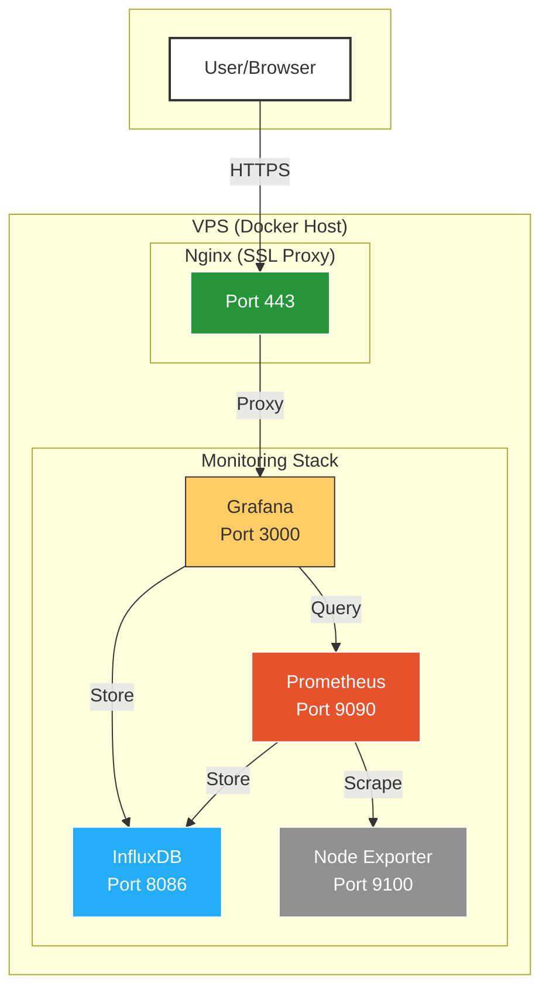

# Docker Monitoring Stack

A comprehensive monitoring solution containerized with Docker, featuring:

- **Grafana** for visualization
- **Prometheus** for metrics collection
- **Node Exporter** for system metrics
- **InfluxDB** for time-series data storage
- **Nginx** with SSL termination

## Prerequisites

- Docker Engine 20.10+
- Docker Compose 2.0+
- 4GB RAM (minimum)
- 2 CPU cores (minimum)

## Quick Start

```bash
# Clone the repository
git clone git@github.com:Shihab-1/docker-monitoring.git
cd docker-monitoring

# Copy environment template
cp .env.template .env

# Edit configuration (optional)
nano .env

# Deploy the stack
docker-compose up -d

Architecture
Diagram
Code
Component Overview
Service	Port	Description	Access URL
Grafana	3000	Visualization dashboard	https://your-domain.com
Prometheus	9090	Metrics collection and alerting	http://localhost:9090
Node Exporter	9100	System metrics exporter	http://localhost:9100/metrics
InfluxDB	8086	Time-series database	http://localhost:8086
Nginx	443	HTTPS reverse proxy	https://your-domain.com
Configuration
Environment Variables

Edit .env file to customize:
ini

# Domain configuration
DOMAIN=your-domain.com

# InfluxDB credentials
INFLUXDB_DB=metrics
INFLUXDB_USER=admin
INFLUXDB_PASSWORD=securepassword

# Prometheus retention period
PROMETHEUS_RETENTION=15d

SSL Certificates

Place your certificates in:

    /etc/ssl/certs/ for public certificates

    /etc/ssl/private/ for private keys

Maintenance

Start/Stop Services:
bash

docker-compose start   # Start all services
docker-compose stop    # Stop all services

View Logs:
bash

docker-compose logs -f grafana  # Monitor Grafana logs

Update Containers:
bash

docker-compose pull    # Pull latest images
docker-compose up -d   # Recreate containers

Troubleshooting
Common Issues

    SSL Errors:

        Verify certificate paths in nginx/ssl/ssl.conf

        Ensure proper permissions:
        bash

        chmod 644 /etc/ssl/certs/your-cert.crt
        chmod 600 /etc/ssl/private/your-key.key

    Grafana Dashboard Not Loading:

        Check datasource configuration in Grafana

        Verify Prometheus targets at http://localhost:9090/targets

License

MIT License - See LICENSE for details.
text


### Key Features of This README:
1. **Professional Badges** - Shows technology stack at a glance
2. **Clear Architecture Diagram** - Visual representation using Mermaid
3. **Table Format** - Easy-to-scan service information
4. **Code Blocks** - Ready-to-use commands
5. **Troubleshooting Section** - Common issues and solutions
6. **Responsive Design** - Renders well on GitHub and mobile

To implement:
1. Save this as `README.md` in your project root



2. Customize the `DOMAIN` and other variables
3. Add your actual license file if needed
4. Commit and push:
   ```bash
   git add README.md
   git commit -m "docs: Add professional README"
   git push origin main
